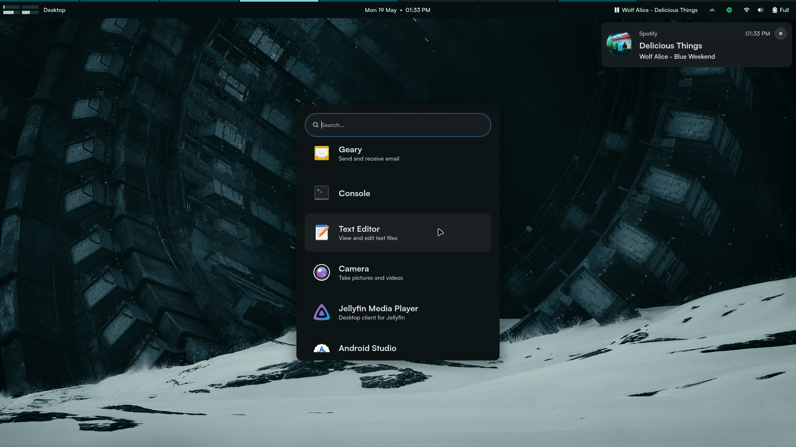
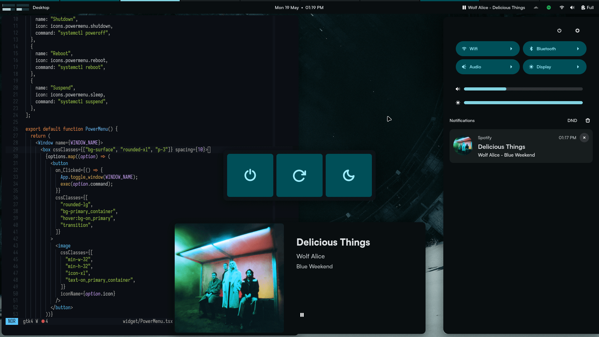

# Desktop Shell




## Dependencies

```sh
# Bundler
ags

# Clipboard
wl-clipboard
cliphist
imagemagick

# Color generation (optional)
matugen
```

## Prerequisities

Install npm packages (use preferred package manager):

```sh
bun install
```

Generate types:

```sh
ags types
```
