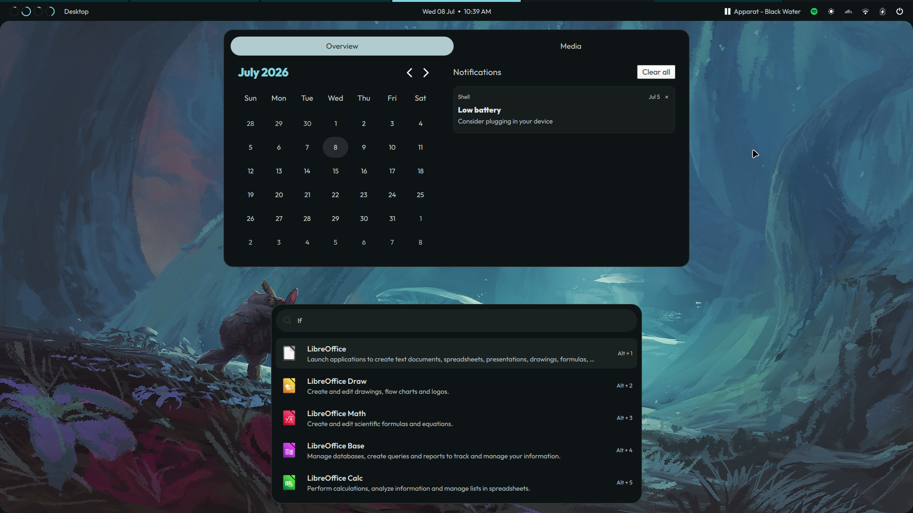

# Desktop Shell

A [Quickshell](https://quickshell.outfoxxed.me/) based UI for the [Niri](https://github.com/YaLTeR/niri) Wayland compositor.

> **Note:** The older AGS (Aylur's GTK Shell) version of this config is available on the [`ags/main`](https://github.com/hashankur/desktop-shell/tree/ags/main) branch.

## Preview

Top bar with workspace indicators, system stats, clock, media, tray, wifi, battery, and power button. Fullscreen overlays for launcher, clipboard, dashboard, and power menu.



## Features

- **Top bar**: per-screen, with Niri workspace strip, CPU/RAM/GPU/temp rings, focused window, clock, media, system tray, WiFi, battery, power button
- **App launcher**: fuzzy search over desktop entries, keyboard navigation, Alt+number shortcuts
- **Clipboard history**: `cliphist`-backed picker
- **Dashboard**: tabbed overlay with calendar, notification history
- **Notifications**: dismiss, click-to-invoke actions
- **OSD**: volume and brightness (pill-shaped overlays)
- **Power menu**: shutdown, restart, suspend, logout with fullscreen overlay

## Requirements

| Dependency | Purpose |
|---|---|
| [Quickshell](https://quickshell.outfoxxed.me/) >= 0.3.0 | Shell framework |
| [Niri](https://github.com/YaLTeR/niri) | Wayland compositor |
| [cliphist](https://github.com/sentriz/cliphist) | Clipboard history |
| [wl-clipboard](https://github.com/bugaevc/wl-clipboard) | `wl-copy` for clipboard writes |
| [MoreWaita](https://github.com/varlesh/MoreWaita) | Icon theme |

## Installation

```sh
git clone https://github.com/youruser/neue.git ~/.config/quickshell/neue
```

Ensure the required dependencies are installed, then launch with the command below.

## Usage

```sh
qs -c neue -d
```

The shell auto-reloads on file changes.

### IPC

```sh
# Toggle app launcher
qs -c neue ipc call launcher toggle

# Toggle clipboard history
qs -c neue ipc call clipboard toggle

# Toggle power menu
qs -c neue ipc call powermenu toggle
```

Bind these to compositor keybindings for keyboard-driven access.
