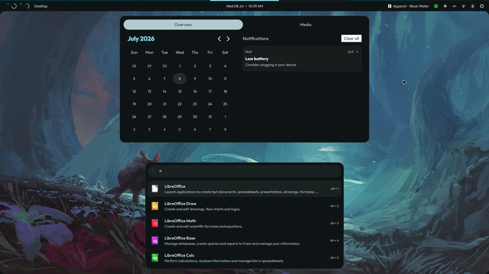

# Desktop Shell

A [Quickshell](https://quickshell.outfoxxed.me/) based UI for the [Niri](https://github.com/YaLTeR/niri) Wayland compositor.

> **Note:** The older AGS (Aylur's GTK Shell) version of this config is available on the [`ags/main`](https://github.com/hashankur/desktop-shell/tree/ags/main) branch.

## Preview

Top bar with workspace indicators, system stats, clock, media, tray, wifi, battery, and power button. Fullscreen overlays for launcher, clipboard, dashboard, and power menu.



## Features

- **Top bar**: per-screen, with Niri workspace strip, CPU/RAM/GPU/temp rings, focused window, clock, media, system tray, WiFi, battery, power button
- **App launcher**: fuzzy search over desktop entries, keyboard navigation, Alt+number shortcuts
- **Clipboard history**: `cliphist`-backed picker
- **Dashboard**: tabbed overlay with calendar, notification history, usage graphs, and media controls
- **Calendar**: ICS feeds (Google Calendar secret address or any ICS URL) with per-feed event colors, dots on the month grid, click a day to drill into its events
- **Notifications**: dismiss, click-to-invoke actions; critical urgency gets sticky toasts, error accent, and DND bypass
- **OSD**: volume, microphone, and brightness (single shared pill)
- **Power menu**: lock, logout, suspend, shutdown, restart, firmware setup

## Roadmap

- Built-in lock screen (Quickshell libraries instead of an external locker)
- Wallpaper manager
- Theme/scheme manager (light/dark and accent switching)

## Requirements

| Dependency | Purpose |
|---|---|
| [Quickshell](https://quickshell.outfoxxed.me/) >= 0.3.0 | Shell framework |
| [Niri](https://github.com/YaLTeR/niri) | Wayland compositor |
| [qml-niri](https://github.com/imiric/qml-niri) | QML plugin (`import Niri`) for workspaces / window state |
| [cliphist](https://github.com/sentriz/cliphist) | Clipboard history |
| [wl-clipboard](https://github.com/bugaevc/wl-clipboard) | `wl-copy` for clipboard writes |
| [MoreWaita](https://github.com/somepaulo/MoreWaita) | Icon theme |

## Installation

```sh
git clone https://github.com/hashankur/desktop-shell.git ~/.config/quickshell/neue
```

Ensure the required dependencies are installed, then launch with the command below.

## Usage

```sh
qs -c neue -d
```

The shell auto-reloads on file changes.

### Calendar events

Create `~/.config/quickshell/calendar.json` with your ICS feed URLs (Google Calendar: *Settings → your calendar → Integrate with third-party apps*, use the secret address in iCal format):

```json
{
  "feeds": [
    { "url": "https://calendar.google.com/calendar/ical/your.address%40gmail.com/private-abc123/basic.ics", "color": "#039BE5" }
  ]
}
```

Plain URL strings are still accepted (the theme's primary color is used). Google's ICS export carries no color data, so set `color` to your calendar's hex from Google Calendar settings — the built-in palette:

| Name | Hex | Name | Hex |
|---|---|---|---|
| Tomato | `#D50000` | Flamingo | `#E67C73` |
| Tangerine | `#F4511E` | Banana | `#F6BF26` |
| Sage | `#33B679` | Basil | `#0B8043` |
| Peacock | `#039BE5` | Blueberry | `#3F51B5` |
| Lavender | `#7986CB` | Grape | `#8E24AA` |
| Graphite | `#616161` | | |

Non-Google feeds that ship RFC 7986 `COLOR` / `X-WR-CALCOLOR` get that color automatically — the config `color` wins if both are present. `webcal://` and `file://` URLs work as well. Feeds refresh every 15 minutes, and when the dashboard opens if the last fetch is over 5 minutes old.

### IPC

```sh
# Toggle app launcher (also: open, close)
quickshell ipc --path ~/.config/quickshell/neue/shell.qml call launcher toggle

# Toggle clipboard history (also: open, close)
quickshell ipc --path ~/.config/quickshell/neue/shell.qml call clipboard toggle

# Toggle power menu (also: open, close)
quickshell ipc --path ~/.config/quickshell/neue/shell.qml call powermenu toggle

# Toggle dashboard (also: open, close); jump to a tab with: openView overview|system|mpris
quickshell ipc --path ~/.config/quickshell/neue/shell.qml call dashboard toggle

# Toggle quick settings (also: open, close)
quickshell ipc --path ~/.config/quickshell/neue/shell.qml call quicksettings toggle
```

Bind these to compositor keybindings for keyboard-driven access.
